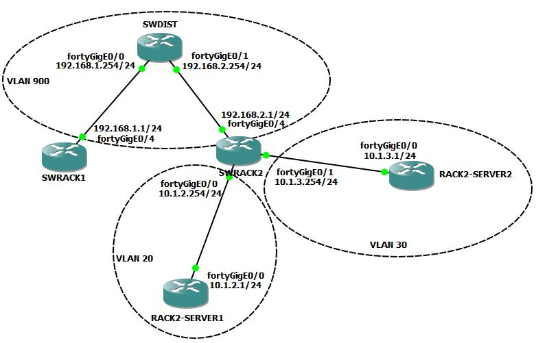
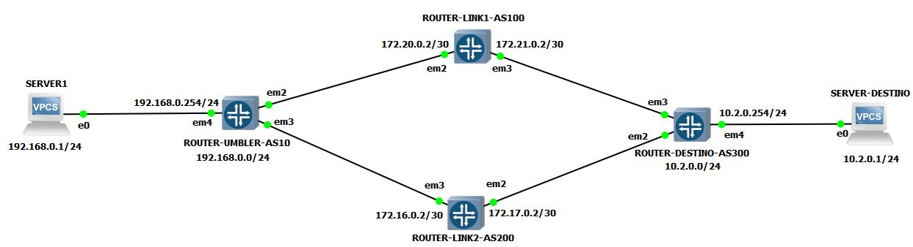

# Desafios técnicos de rede para o Provider

Esse repositório contém as instruções necessárias para rodar os desafios técnicos 1 e 2 de rede.

- O desafio técnico 1 tem como objetivo testar a habilidade de se criar rotas estáticas em roteadores Dell.
- O desafio técnico 2 tem como objetivo testar a habilidade de se lidar com rotas dinâmicas BGP em roteadores Juniper.

Para realizar os desafios, utilizamos o software GNS3 versão 2.2.45: https://www.gns3.com/software/download.

Juntamente com a VM, versão Hyper-v: https://gns3.com/software/download-vm.

Os arquivos para criar os template do Dell 9.8 e Juniper vMX podem ser baixados utilizando o seguinte endereço: https://1drv.ms/f/s!AiSFfkSKD2L8jbFonPDqstIfKK3HRQ?e=meeCgQ

Fique a vontade para criar o ambiente de GNS3 da forma mais cômoda para você.

Se entender que terá dificuldades em levantar esses ambientes no dia da apresentação, grave um vídeo mostrando o ambiente, os entregáveis e nos envie.

## Desafio Técnico de Redes Umbler 1 - Roteamento estático

Esse desafio consiste em configurar uma rede conforme a topologia informada na imagem challenge-1-topologia-rede, utilizando roteadores Dell OS 9.8, segue abaixo mais detalhes sobre o que queremos.

## Entregáveis

Nos envie as linhas de comandos executadas para configurar cada um dos roteadores. Também forneça prints com o resultado de ping e traceroute conforme abaixo:

```
- Origem: SWRACK1 
- Destino: SWRACK2-SERVER1
```
```
- Origem: SWRACK1 
- Destino: SWRACK2-SERVER2
```
```
- Origem: SWRACK2-SERVER1
- Destino: SWRACK2-SERVER2
```

**ATENÇÃO**
- Os roteadores Dell no GNS3 possuem alguns problemas, em alguns casos foi necessário recriar o ambiente do zero devido ao travamento da VM.
- O ambiente com todos os roteadores ligados consumiu entre 8 e 12 GB de RAM.
- Devido a falta de compatibilidade, foi utilizado roteadores como servidores (SWRACK2-SERVER1 e SWRACK2-SERVER2).
- O traceroute poderá não mostrar o IP do destino final, porém, o ping deve retornar o resultado normal.
- As placas fortyGigE mostradas na topologia (print direto do GNS3) não seguem o mesmo padrão de nome no SO. Utilize o seguinte mapa:
  - fortyGigE 0/0 no GNS3 significa fortyGigE 0/0 no roteador;
  - fortyGigE 0/1 no GNS3 significa fortyGigE 0/4 no roteador;  
  - fortyGigE 0/4 no GNS3 significa fortyGigE 0/16 no roteador;

Topologia de Rede - Desafio 1



--------------------

## Desafio Técnico de Redes Umbler 2 - Roteamento dinâmico (BGP)

Esse desafio consiste em exercitar as habilidades técnicas envolvidas no protocolo BGP. Crie uma rede utilizando esse protocolo conforme a topologia de rede enviada abaixo.

Queremos que o SERVER1 consiga acessar o SERVER-DESTINO através dos 2 links intermediários, mas, preferencialmente pelo link1 (ROUTER-LINK1-AS100). Então, caso essa conexão caia, automaticamente o tráfego deve ser desviado para o link2 (ROUTER-LINK2-AS200) e quando o link1 voltar, o tráfego deve retornar à ele de forma automática.

Para os servidores, utilizamos o template default do GNS3, chamado VPCS.

### Entregáveis:

- Documentação dos comandos executados em cada roteador;
- Ping saindo do SERVER1 até o SERVER-DESTINO;
- Trace saindo do SERVER1 até o SERVER-DESTINO;
- Simular queda do link1 e nos enviar ping, trace e sumário da conexão BGP do ROUTER-UMBLER;
- Retornar o link1 e nos enviar os pings, trace e conexão BGP atualizadas.

Topologia de Rede - Desafio 2

